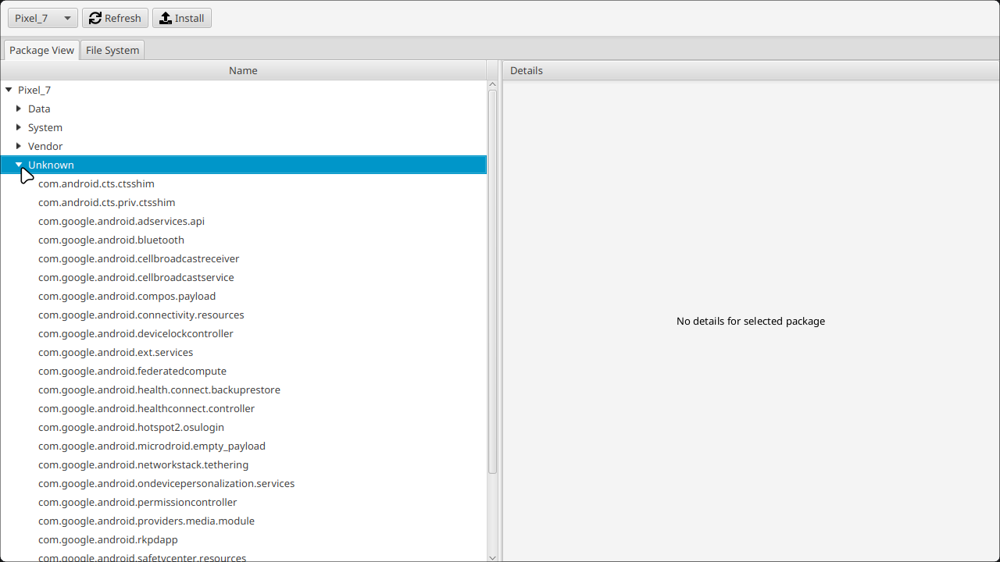
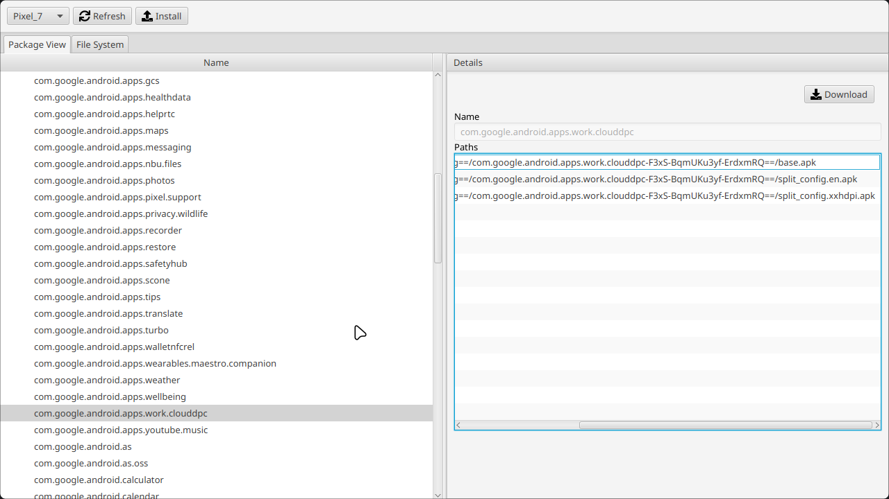
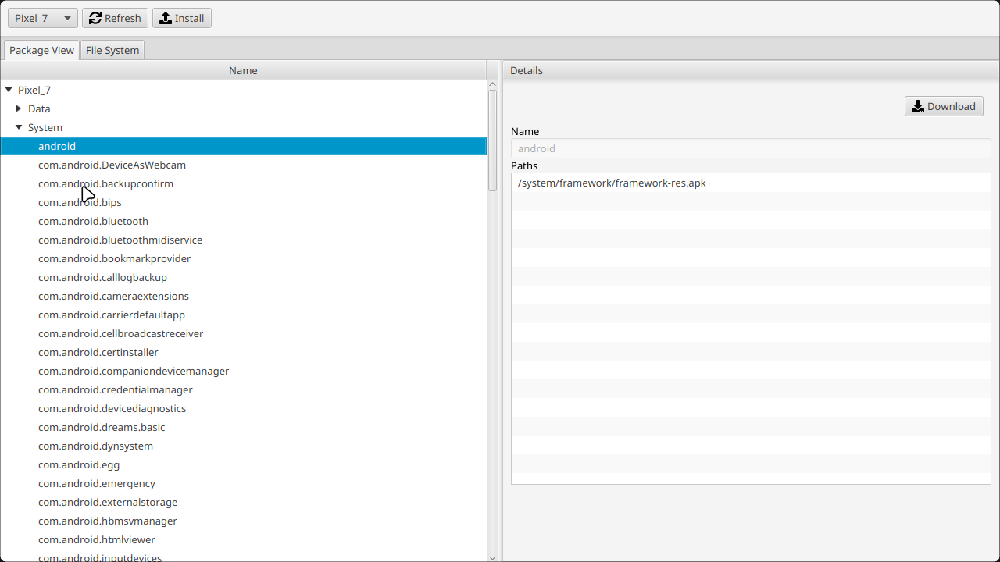
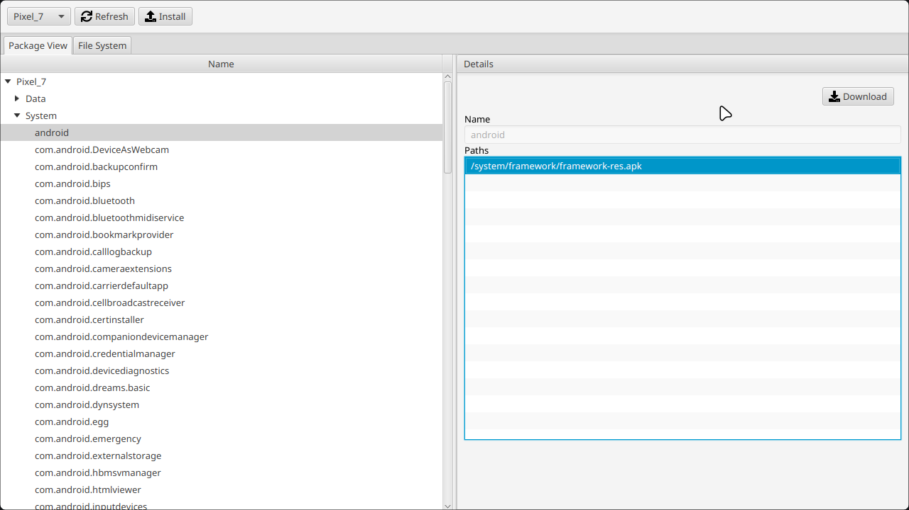

# Package Manager 

> [!WARNING]  
> *Still WIP*

Android Package Manager written in Kotlin. Quickly explore, download, or install APKs and Android App Bundles. Lets you quickly manage all your Android apps on your desktop PC.

Fully async and high performant, making use of Kotlin's coroutines and JavaFX.

###
To run execute the following command:
<details open>
  <summary><b>Windows</b></summary>

  ```sh
  gradlew.bat run
  ```
</details>

<details open>
  <summary><b>Linux</b></summary>

  ```sh
  ./gradlew run
  ```
</details>

Make sure you have a working ADB installation and the `adb` command is in your `PATH`.

Install using the following commands:
<details>
  <summary><b>Debian based Distro</b></summary>
  
  ```sh
  sudo apt-get install android-tools-adb 
  ```
</details>
<details>
  <summary><b>Arch based Distro</b></summary>
  
  ```sh
  sudo pacman -S android-tools
  ```
</details>
<details>
  <summary><b>Fedora/SUSE</b></summary>
  
  ```sh
  sudo dnf install android-tools
  ```
</details>
<details>
  <summary><b>Nix</b></summary>
  
  ```sh
  nix-env -i android-tools
  ```
</details>
<details>
  <summary><b>Windows</b></summary>
  
  ```sh
  winget install AndroidSDK.AndroidCommandLineTools
  ```
</details>


## Screenshots




